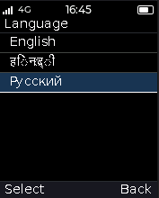
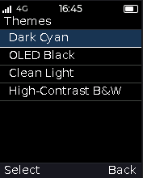
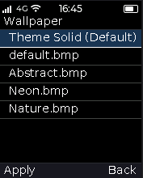
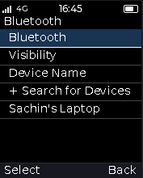
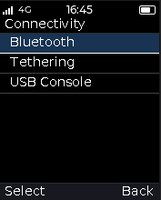
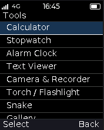

# VeebhaOS v1.0 — Feature Showcase & System Overview

> **VeebhaOS** is a lightweight, zero-coordinate, embedded RTOS-based operating system designed for feature phones and resource-constrained microcontrollers. Engineered with a strict **Zero-Floating-Point (Integer-only)** policy, VeebhaOS delivers a modern feature phone user experience on both bare-metal RTOS (FreeRTOS / RDA8809) and the Linux kernel.
>
> 📜 *Read the [Release Manifesto & Author Note](AUTHOR_NOTE.md) by Sachin Arunrao Borkar.*

---

## 1. System Shell & Core User Experience

### Universal Quick Settings & Notification Drawer
* **Accessible Anywhere**: Press and hold the **CALL** key in any app or game to instantly pull down the dual-page drawer.
* **Instant Toggle**: A short press of the **CALL** key switches seamlessly between incoming Notifications and the Quick Settings 3×2 grid (Bluetooth, Backlight, Sound Profiles, Torch, Battery, Settings shortcut).
* **Now-Playing Media Card**: Play, pause, and track media progress without leaving your active game.

| **Quick Settings with Media Control** | **One-Line Notification Deck** |
| :---: | :---: |
|  |  |

### Preemptive Multitasking & Task Switcher
* **Hardware Long-Press Switcher**: Hold the **`*`** key anywhere in the OS to open the visual card Task Manager.
* **Background & Resume**: Switch between active running apps, pause background tasks, kill memory hogs, or jump instantly to the Idle Home Screen.

| **Multitasking Card Switcher (3 Tasks Running)** |
| :---: |
|  |

### Dynamic Idle Screen Live Pill
* **Priority Status Bar Pill**: Contextual interactive badge on the Idle screen displaying real-time activity:
  - 📞 Ongoing phone call with live duration
  - 🎵 Music track title & artist (Walkman)
  - 📻 Active FM Radio frequency
  - ⏱ Countdown timer ticks
* **One-Click Jump**: Press **OK** on the idle pill to jump straight into the running background application.

| **Idle Screen with Live Pill & Wallpaper** |
| :---: |
|  |

---

## 2. Display, Themes & Typography

### 4 Distinct Built-in Themes
Instant system-wide color palette switching persisted across reboots:
1. **Dark Cyan** (Default): Slate dark `#121212` background with vibrant cyan accents.
2. **OLED Black**: Pure `#000000` pixel-off contrast for maximum battery efficiency.
3. **Clean Light**: Crisp chalk `#F1F5F9` background with deep slate-blue highlights.
4. **High-Contrast B&W**: Stark monochrome styling designed for ultra-low vision and direct sunlight readability.

| **Dark Cyan (Default)** | **OLED Black** | **Clean Light** | **High-Contrast B&W** |
| :---: | :---: | :---: | :---: |
|  |  |  |  |

### Multilingual Typography & Font Shaper
* Native UTF-8 string support with fallback glyph rendering.
* Full support for **English** (Latin) and **Russian** (Cyrillic).
* Embedded Indic script infrastructure for **Hindi** (Devanagari).

| **Language Selection** | **High-Contrast Monochrome Applied** |
| :---: | :---: |
|  |  |

---

## 3. Storage, Configuration & Hardware Testing

### CRC16-Protected Virtual NVRAM
* Hardware-agnostic persistent settings engine backed by flash or local storage.
* Stores sound profile, language, theme palette, wallpaper, Bluetooth state, and alarm timers.
* Automatically verifies data integrity with a CCITT CRC16 checksum on every boot, cleanly reverting to defaults if corrupted.

| **Settings Menu** | **Theme Selector** | **Wallpaper Selection** | **About Phone (Hardware)** |
| :---: | :---: | :---: | :---: |
|  |  |  |  |

### Real Hardware Tested Subsystems
Verified on real silicon (RDA8809 / OBTEL B10) and desktop simulator:
* **Display**: 176×220 16-bit RGB565 LCD (ILI9225G) driven by **RDA GOUDA 2D Hardware DMA** blitter.
* **Keypad**: 4×5 hardware matrix with full 5-way D-Pad, dual Softkeys (`LSK`/`RSK`), and Call/End keys.
* **Power Management**: Live ADC battery voltage fuel-gauge and USB charger detect.
* **PWM Backlight & Torch**: Multi-level brightness scaling and hardware LED flashlight.
* **USB Debugging**: 16 KiB non-blocking ring-buffered USB CDC-ACM virtual serial console (`/dev/ttyACM0`) for kernel logs and live diagnostics.

---

## 4. Connectivity & Internet Lite

### Tiny Web Browser
* Built-in lightweight HTML/WAP browser engine.
* Parses web links, forms, and formatted paragraphs over Bluetooth PANU tethering.
* Supports URL history, Back navigation, and web search shortcuts.

| **Tiny Web Browser (WAP/HTTP)** | **Bluetooth Settings** | **Connectivity / Tethering** |
| :---: | :---: | :---: |
|  |  |  |

### Bluetooth 2.1+EDR Stack
* **OBEX File Transfer**: Send and receive `.vapp` binaries and images wirelessly.
* **BNEP / PAN**: Mobile Internet tethering.

---

## 5. Built-in Apps & Fun Zone Store

### VeebhaOS Fun Zone (`.vapp` Dynamic Loader)
Single-file dynamic binary app store with zero compilation overhead:
* **Brick Breaker**: 60 FPS retro arcade breakout game.
* **Tetris Retro**: Complete 10×16 matrix block stacker with rotation physics.
* **Space Shooter**: Full-screen scrolling galactic space combat.
* **Tools & Utilities**: Chip Synth, Morse Flasher, Unit Converter, and System Resource Monitor.

| **Fun Zone App Store** | **Brick Breaker (60 FPS)** | **Tetris Retro** | **Space Shooter** |
| :---: | :---: | :---: | :---: |
|  |  |  |  |

### Essential Feature Phone Suite
* **Telephony Suite**: Dialer with quick-match, SMS inbox with T9 text editor, Contacts directory, and In-Call HUD.
* **Tools Suite**: Stopwatch & Countdown Timer with mode toggling, Alarm Clock with high-contrast field picking, Voice/Audio Recorder, Calculator, and File Manager.
* **Media**: Walkman Music Player with MP3/WAV playback, FM Radio tuner, and Photo Gallery.

| **Walkman Music Player** | **FM Radio Tuner** | **Tools Suite** | **File Manager** |
| :---: | :---: | :---: | :---: |
|  |  |  |  |

---

## 6. Architecture & Portability

* **Zero-FPU Guarantee**: 100% fixed-point integer math — zero floating-point registers used.
* **Dual-Target Portability**: Runs natively on bare-metal RTOS (FreeRTOS) and Linux kernel (fbdev/evdev).
* **Decoupled Out-of-Tree BSP**: Clean-room MIT core decoupled from proprietary vendor baseband SDKs.

---

## 7. Live Hardware Execution (OBTEL B10 Silicon)

The photographs below verify **VeebhaOS v1.0 running on physical silicon** — an OBTEL B10 feature phone powered by the RDA8809 MIPS32r1 CPU with 8 MB RAM, 176×220 LCD, and hardware matrix keypad:

| **Idle Screen Live Pill** | **App Launcher Grid** | **Task Switcher** |
| :---: | :---: | :---: |
|  |  |  |

| **Brick Breaker on LCD** | **Tetris Retro Action** | **About Phone Specs** |
| :---: | :---: | :---: |
|  |  |  |

